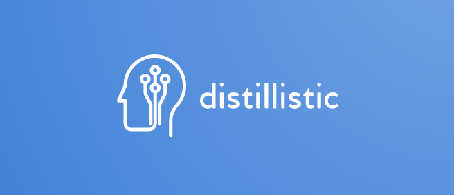

## Knowledge distillation algorithms in PyTorch
This repository holds the source code for Pia Čuk's Master thesis on knowledge distillation algorithms for deep neural networks. The title of the thesis and abstract can be found below.

## Greater than the Sum of its Parts? A Realistic Perspective on Online Distillation for Efficient Deep Learning
### Abstract
While state-of-the-art artificial neural networks continue to grow in size, many applications in the real world require models to be small in memory and fast in computation. For the problem of image classification, Hinton et al. (2015) introduced Knowledge Distillation (KD), where knowledge is transferred from a high-capacity network to an efficient student network. Based on this algorithm, Zhang et al. (2018) created Deep Mutual Learning (DML), an online distillation algorithm where multiple networks learn to solve the training task collaboratively.

In this work, we provide insight into the mathematical foundations of DML using concepts of statistics and information theory. We show that in DML, the student also learns from a singular teaching signal, namely the average of the student cohort predictions, and therefore has strong parallels to KD. Furthermore, we conclude that in the training process, DML behaves identically to its variant with ensemble teacher, DML_e. As the main difference between DML and KD is the source of the teaching signal, we conduct extensive experiments comparing the distillation algorithms on two popular image classification benchmarks. These show that DML suffers from instability during the training process, which prevents the models from converging to high-accuracy solutions. We test a range of variations to the DML algorithm to validate this, all exhibiting instability in training.

Extending our analysis to a self-distillation algorithm, we show that Teacher-free Knowledge Distillation with virtual teacher (Tf-KD_virtual, Yuan et al., 2020) biases the student to under-confident and high-entropy predictions that do not generalize well. By improving the calibration of the teaching signal, we significantly improve the student's performance, showcasing the importance of a well-calibrated teacher, as the theoretical work in the field suggests. We find that monitoring the Expected Calibration Error (ECE, Naeini et al., 2015) is very effective for this purpose and a valuable additional metric for the interpretation of the results of a predictive model.

Finally, we propose a novel distillation setup called cross-quality distillation. Here, we wish to make the student model more data-efficient by using lower image resolutions. We compare it to DML in a set of downscaling experiments on the ImageNet dataset. As for the other experiments, the results illustrate the importance of reflecting the uncertainty inherent in the training data in the model's predictions.

### Experiments

We implement the following existing algorithms:
- Knowledge Distillation (KD, Hinton et al., 2015)
- Deep Mutual Learning (DML, Zhang et al., 2018)
- Teacher-free Knowledge Distillation with virtual teacher (Tf-KD_virtual, Yuan et al., 2020)

We compare these algorithms on two popular image classification benchmarks, Fashion-MNIST and ImageNet.

Additionally, we introduce a novel distillation setup, namely cross-quality distillation. In cross-quality KD, the teacher is pre-trained on full-resolution images, while the student learns on low resolution. The goal of cross-quality KD is that the student learns meaningful features from the teaching signal that it could not learn from the low-resolution images alone. We compare cross-quality KD to DML in a set of downscaling experiments.

### Resources

The KD, DML, and Tf-KD_virtual implementations were based on the KD_Lib library (Shah et al., 2020). We used the pre-trained ImageNet models from torchvision, a library that is part of the PyTorch framework (Paszke et al., 2019). Both datasets used, Fashion-MNIST and ImageNet, are publicly available.

## References
- Hinton, Geoffrey, Oriol Vinyals, and Jeff Dean. "Distilling the knowledge in a neural network." arXiv preprint arXiv:1503.02531 (2015).
- Naeini, M. P., Cooper, G., & Hauskrecht, M. (2015). "Obtaining well calibrated probabilities using bayesian binning." Twenty-Ninth AAAI Conference on Artificial Intelligence.
- Paszke, Adam, et al. "PyTorch: An imperative style, high-performance deep learning library." Advances in neural information processing systems 32 (2019).
- Shah, Het, et al. "KD-Lib: A PyTorch library for knowledge distillation, pruning and quantization." arXiv preprint arXiv:2011.14691 (2020).
- Yuan, Li, et al. "Revisiting knowledge distillation via label smoothing regularization." Proceedings of the IEEE/CVF Conference on Computer Vision and Pattern Recognition. 2020.
- Zhang, Ying, et al. "Deep mutual learning." Proceedings of the IEEE Conference on Computer Vision and Pattern Recognition. 2018.
